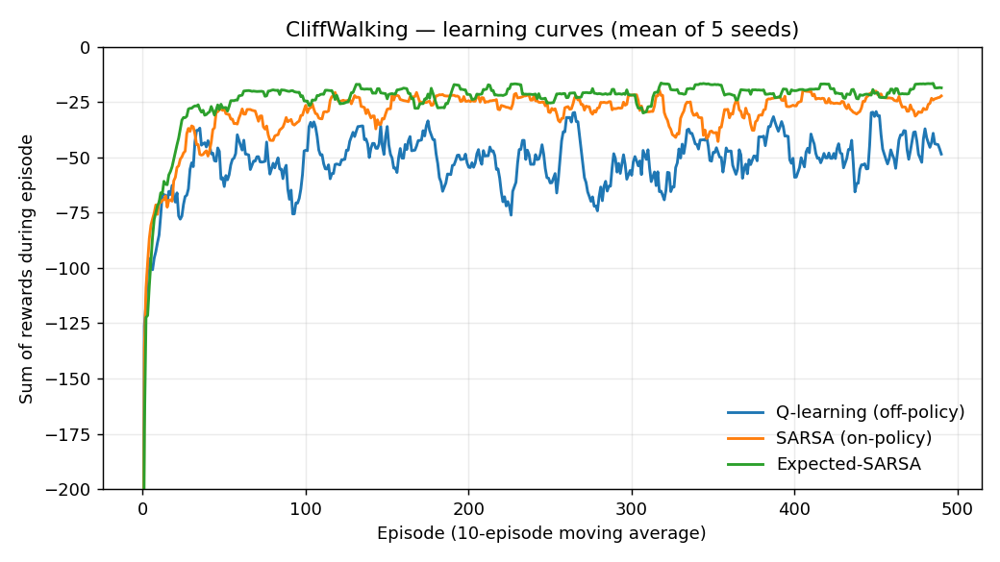
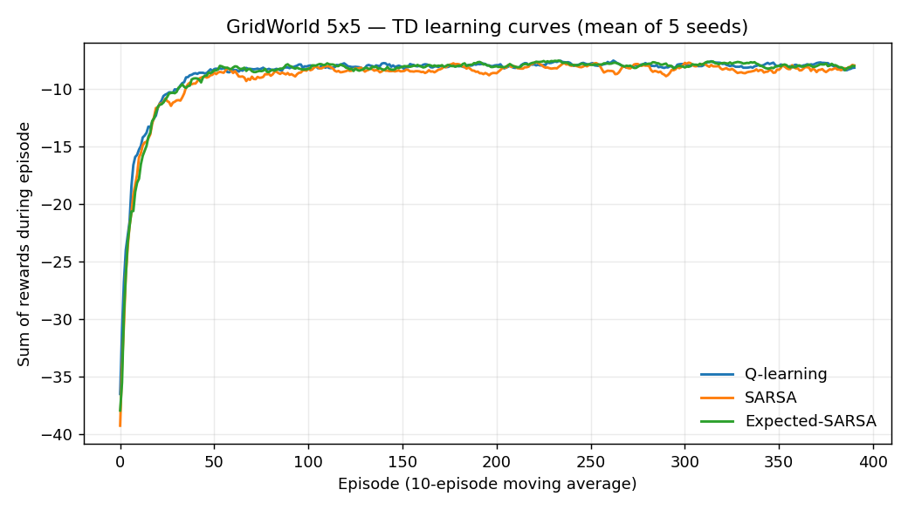
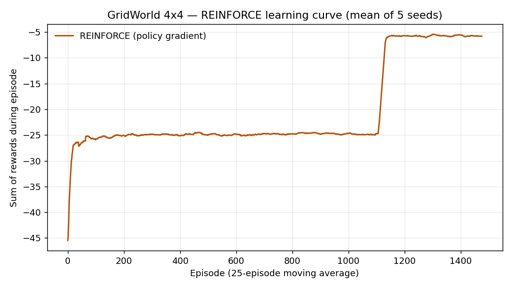

# RL Control Lab

A hands-on laboratory of the classic reinforcement-learning control algorithms —
from tabular Q-learning to policy gradients — implemented from scratch and
benchmarked on the same control environments. Pure `numpy` + `matplotlib`; the
environments are written by hand (no gym / gymnasium).

- **Live site:** https://andreaisabelmontana.github.io/rl-control-lab/

## What's here

```
rllab/
  envs/           GridWorld, CliffWalking, WindyGridWorld (reset/step API)
  agents/         Q-learning, SARSA, Expected-SARSA, REINFORCE
  train_loop.py   shared TD + Monte-Carlo training / evaluation loops
train.py          run all experiments -> figures/ + comparison tables
tests/            pytest suite (env dynamics + learning behaviour)
```

## Environments (implemented from scratch)

Every environment exposes a Gym-style API — `state = env.reset()`,
`next_state, reward, done, info = env.step(action)` — with integer states and
4 actions (up / right / down / left). No external RL library is used.

- **GridWorld** — deterministic grid, −1 per step, 0 at the goal; walls and the
  edge block movement. Optimal policy is the shortest path.
- **CliffWalking** (Sutton & Barto, Ex. 6.6) — 4×12 grid. Stepping into the
  cliff costs −100 and teleports back to the start (episode continues); the goal
  is terminal. This is the task that separates on-policy from off-policy control.
- **WindyGridWorld** (Ex. 6.5) — 7×10 grid with a column-dependent upward
  "wind" that drifts the agent every move — a discretised disturbance-rejection
  control task.

## Algorithms and update rules

All four share an epsilon-greedy Q-table (or softmax policy) and a common train
loop. `s,a,r,s'` is the transition; `alpha` the step size, `gamma` the discount.

**Q-learning** — off-policy TD control. Bootstraps from the greedy next value:

```
Q(s,a) <- Q(s,a) + alpha [ r + gamma * max_a' Q(s',a') - Q(s,a) ]
```

**SARSA** — on-policy TD control. Bootstraps from the action `a'` actually
taken by the behaviour policy:

```
Q(s,a) <- Q(s,a) + alpha [ r + gamma * Q(s',a') - Q(s,a) ]
```

**Expected-SARSA** — uses the expectation over the epsilon-greedy policy `pi`
instead of a single sample, removing the sampling variance of SARSA:

```
Q(s,a) <- Q(s,a) + alpha [ r + gamma * sum_a' pi(a'|s') Q(s',a') - Q(s,a) ]
```

**REINFORCE** — Monte-Carlo policy gradient. A softmax policy over a linear
preference `theta[s,a]` (one-hot state features). After each episode, with
return `G_t = sum_{k>=t} gamma^{k-t} r_k` and baseline `b`:

```
theta[s_t] <- theta[s_t] + alpha (G_t - b) ( onehot(a_t) - pi(.|s_t) )
                         + beta * grad H(pi(.|s_t))
```

The baseline `b` (running mean return) cuts variance; the entropy bonus `beta`
keeps exploration alive. The default drops the strict `gamma^t` step weighting,
which otherwise starves the start state of gradient and lets its softmax collapse
onto a wall-bumping action before the policy ever reaches the goal — a real
sparse-reward failure mode (`discount_gradient=True` restores the textbook form).

## Results (real runs, mean of 5 seeds)

Produced by `python train.py`. Greedy return = total reward of the learned
greedy policy (higher = better; the per-step cost is −1).

### CliffWalking (4×12) — the classic on-policy vs off-policy result

| Algorithm | Greedy return | Greedy path | Min gap to cliff |
|---|---:|---:|---:|
| Q-learning (off-policy) | −13.00 | 13 steps | 1 row |
| Expected-SARSA | −15.00 | 15 steps | 2 rows |
| SARSA (on-policy) | −17.00 | 17 steps | 2 rows |

Q-learning learns the **optimal risky path** hugging the cliff edge (return −13).
SARSA learns a **safer, longer path** one row back (−17), because its on-policy
backups account for the exploratory steps that occasionally fall off. This is the
textbook Sutton & Barto Figure 6.4 outcome — and on the *online* learning curve
Q-learning's reward is lower precisely because it keeps falling off the edge it
hugs while exploring.



### GridWorld — all four algorithms

| Algorithm | Greedy return |
|---|---:|
| Q-learning | −7.00 |
| SARSA | −7.00 |
| Expected-SARSA | −7.00 |
| REINFORCE | −5.00 |

On the simpler grid all three TD methods find the optimal path (5×5 with a wall
column: −7). REINFORCE reaches the optimal path on the 4×4 variant (−5).





The REINFORCE curve shows the policy-gradient signature: a long plateau while the
preferences shift, then a sharp jump once the greedy path flips to optimal.

## Run it

```bash
pip install -r requirements.txt   # numpy, matplotlib, pytest
python -m pytest -q               # run the test suite
python train.py                   # reproduce figures/ and the tables
```

### Tests

The suite checks both the environments and the learning behaviour:

- **Env dynamics** — CliffWalking reward/cliff-reset, terminal states, edges as
  walls; GridWorld step cost / wall blocking / goal terminality; windy drift.
- **Q-learning converges** to a near-optimal path on a gridworld and beats a
  random policy by a clear margin.
- **SARSA vs Q-learning on the cliff** — SARSA's greedy path stays further from
  the cliff than Q-learning's, and Q-learning's greedy return is at least as good.
- **REINFORCE improves** average return, beats random, and converges to the
  optimal path across every seed.

```
$ python -m pytest -q
...............                                                          [100%]
15 passed in 6.25s
```

## License

MIT — see [LICENSE](LICENSE).
